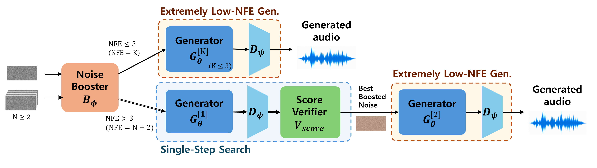

# One-Step Is Enough to Judge: Hybrid Noise Skimming for Full-band Text-to-Audio Generation

**Anonymous Authors** · ICLR 2027 Submission

> **Status (Oct 7, 2026):** The code release, originally scheduled for October 9, 2026, has been **delayed due to a licensing review**. Inference code and pretrained checkpoints will be uploaded as soon as the review is complete, and this README will be updated with a new date. Audio samples and result tables are already available on the [project page](https://briskmuntjack.github.io).

**Hybrid Noise Skimming** is a few-step text-to-audio (TTA) framework that improves sample quality by selecting better initial noise rather than running more ODE steps. It addresses two failure modes of extremely low-NFE generation: quality that is highly sensitive to the initial noise, and quality that does not improve monotonically with more steps. A learnable **Noise Booster** refines random Gaussian noise toward favorable regions, and **Single-Step Search** picks the best candidate per instance using a single one-step generation. The generator is trained with **x-prediction MeanFlow**, which further strengthens one-step generation quality. At 44.1 kHz, the framework achieves state-of-the-art performance with one-step generation, and quality improves monotonically as the search budget grows.

  

## TODO

- [x] Audio sample page → [briskmuntjack.github.io](https://briskmuntjack.github.io)
- [ ] Release inference code and pretrained checkpoints (delayed due to licensing review; new date TBD)
- [ ] Inference speed optimization
- [ ] Hugging Face demo
- [ ] Release training code

## Installation

_Coming soon._

## Inference

_Coming soon._

## Audio Samples

Each generated by the proposed method (1 NFE and 16 NFE) and by TangoFlux, MeanAudio-L, SoundCTM-DiT, and Stable Audio Open small-ARC, are available on the [project page](https://briskmuntjack.github.io/#samples).

